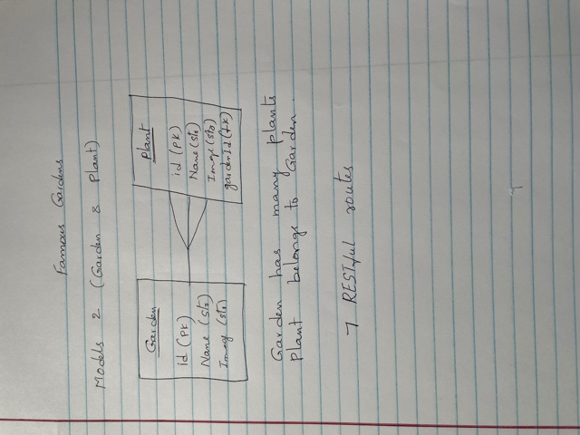

# Unit4 Project - Famous Gardens
# Backend app with Node/Express
One of my hobby is gardening. So, wanted to create an app with different gardens and associated plants.

### Project Links
- GitHub Repository: https://github.com/sp53852/Unit4-Gardens-api-backend
- Heroku Deployment: https://gardenplantssharmila.herokuapp.com/api/gardens

### Wireframes
 - 

## Requirements
### Technical Requirements
-	Node.js, Express
-	Javascript
-	Restful Routes
-	Postgres
-	Sequelized data and Associations

## Main File Structure
1. gardensController.js
2. Garden Model
3. Plant Model
4. server.js

### Userstories
1.	As a developer, I want to be able to setup an express app for backend.
2.	As a developer, I want to be able to create schema/tables/model’s setup in postgres. 
3.	As a developer, I want to be able to setup a react app for front end.
4. As a developer, I want to be able to create 7 RESTful routes to map HTTP routes and the CRUD functionality.
5.	As a developer, I want to be able to deploy backend app with Heroku.

## Future Improvements
1. Would like to add User Model with many to many relationship between user and garden. 
2. Would like to add RESTful routes and Signup and login functions to User model.