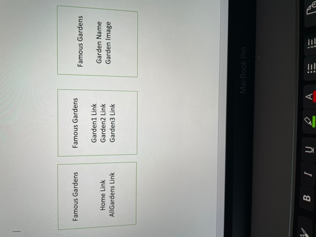
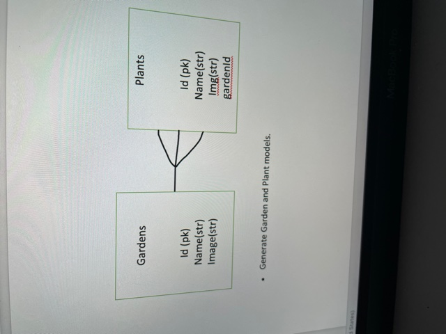

# Initial Planning for Project3 Gardens app
 - One of my hobby is gardening. So, I am planning to create an app with gardens. 
 
 ## Landing Page
 - Home as link 
 - AllGardens as link
  
 ### AllGardents page
 - All gardens link should display list of gardens.

 ### Garden details page
 - Specific garden details page should display details of the garden.

 ## Future Improvements
 - In the Garden details page should also display associated plants to that garden type.

 ## Wireframes
 - 
- 

## User Stories:
1.	As a developer, I want to setup an express app for backend.
2.	As a developer, I want to create schema/tables/model’s setup in postgres. 
3.	As a developer, I want to setup a react app for front end.
4.	As a user, I want to be able to see list of gardens in the garden app.
5.	As a user, I want to be able to see specific garden details.
6.	As a user, I want to be able to see associate plants with the gardens.
7.	As a developer, I want to be able to deploy both backend and front-end apps with Heroku.
